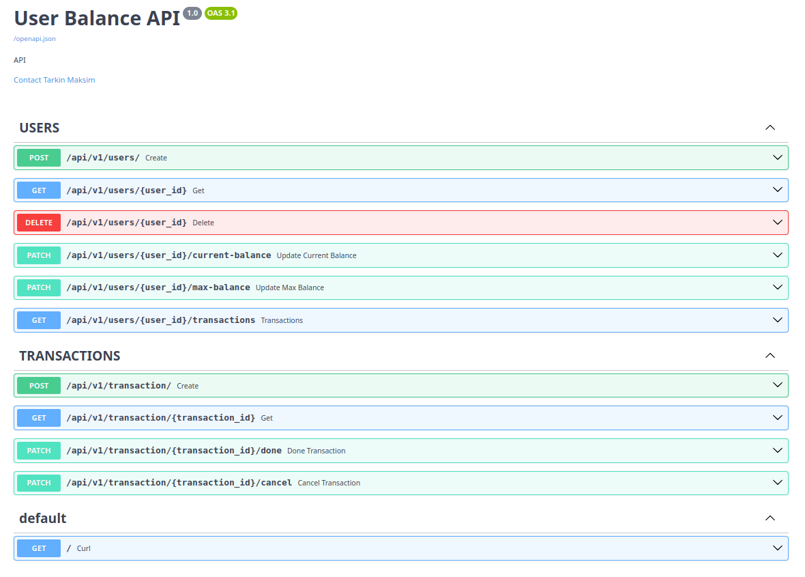

# Микросервис управления пользовательским балансом

Асинхронный микросервис для управления балансом пользователей с поддержкой транзакций.

## 🚀 Возможности

- **Управление балансом**: Текущий и максимальный баланс пользователя
- **Транзакции**: Создание, заврешение, отмена транзакций
- **REST API**: Полноценное RESTful API для всех операций
- **Безопасность**: Межсервисная аутентификация по API-ключу
- **Автоматическая экспирация**: Просроченные транзакции автоматически отменяются

## 📦 Технологический стек

- **Python 3.12+**
- **FastAPI** - REST API framework
- **SQLAlchemy 2.0** - ORM
- **PostgreSQL** - база данных
- **Docker** - контейнеризация
- **Poetry** - управление зависимостями
- **Flake8 & Black** - линтинг и форматирование

## 🏗️ Архитектура

### Основные сущности

```python
class User(Base):
    id: UUID
    current_balance: int  # Текущий баланс (в копейках/центах)
    max_balance: int      # Максимальный баланс

class Transaction(Base):
    id: UUID
    user_id: UUID
    amount: int           # Может быть положительным (пополнение) или отрицательным (списание)
    status: TransactionStatus  # PENDING, CONFIRMED, CANCELLED, EXPIRED
    created_at: datetime
    updated_at: datetime
    timeout_seconds: int
```

### Статусы транзакций
- **PENDING** - транзакция создана, средства заблокированы
- **CONFIRMED** - транзакция подтверждена, средства списаны/зачислены
- **CANCELLED** - транзакция отменена, средства разблокированы
- **EXPIRED** - транзакция просрочена, средства разблокированы

## 🔧 Установка и запуск
### Предварительные требования
- **Python 3.12+**
- **Docker и Docker Compose**
- **Make**


### 1. Локальный запуск
```bash
git clone git@github.com:TMaksimS/user_balance.git && \
cd user_balance && \
mv .env.example .env && \
pip install poetry && \
poetry install --no-root && \
make up_local
```
#### Что делает эта команда:
- Клонирует репозиторий
- Переходит в директорию проекта
- Переименовывает файл с чувствительными данными
- Устанавливает Poetry (если не установлен)
- Устанавливает зависимости через Poetry
- Запускает сервисы через Makefile

### 2. Запуск в контейнере
```bash
git clone git@github.com:TMaksimS/user_balance.git && \
cd user_balance && \
mv .env.example .env && \
make up_stage
```
#### Что делает эта команда:
- Клонирует репозиторий
- Переходит в директорию проекта
- Переименовывает файл с чувствительными данными
- Запускает сервисы через Makefile в контейнерах

### Структура апи доступная по http://127.0.0.1:8000/docs#/ при запуске с дефолтным .env



## Примечание:
- **Сервис** предназначен для образовательных и демонстрационных целей.
- **Для production** использования рекомендуется дополнительная настройка безопасности и мониторинга.
